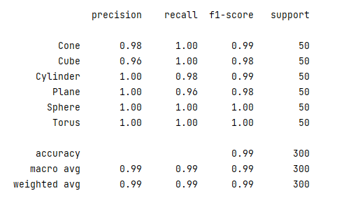

# CNN shape recognition

This is an end-to-end learning project to model and deploy CNNs for classifying .obj primitives.

This project was implemented with PyTorch

Task description
----
A set of 3D primitives is given. We need to solve the problem of classifying objects in the form of a point cloud using neural network.

Primitives model cen recognize: cone, cube, cylinder, plane, torus, sphere.

Data splited into: train, test, valid

For estimating model we'll use scikit classification_report on test set.

---
Requirements for the application
---

Functionality:
 - Ability to load user's .obj 3d model
 - Show rendered 3d object
 - Show how confident model in prediction
 
 The application is deployed using a docker container.
 CI/CD maked by GitHub Actions
 
---
Implementation
---

Since our task is a point cloud task, the best solution is to use the PointNet architecture.

The implemented model yields almost perfect metrics on the final validation dataset:

The application is implemented on the Streamlit api.

 
