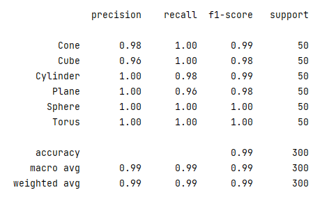

## Documentation

 - [Workflows](recognizer3d/app.md): main workflows.
 - [recognizer3d](recognizer3d/data.md): documentation of functionality

---
Implementation
---

Since our task is a point cloud task, the best solution is to use the PointNet architecture.

The implemented model yields almost perfect metrics on the final validation dataset:

The application is implemented on the Streamlit api.

## Project layout

    config/
        args.json           # json with needed params
        confg.py            # config file for path declaration
    data/                   # folder with all data separated by shape then by split
    mkdocs.yml              # The configuration file.
    docs/      
        index.md            # The documentation homepage.
        recognizer3d/       # The documentation for each file
    images/      
    models/      
        encoder.pkl         # dumpded encoder for encoding targer
        modelv1             # The model weights of PointNet()
    recognizer3d/      
        app.py              # The main stramlit runer with rendering functionality
        data.py             # Loading and processing data
        evaluate.py         # Evaluation model's metrics
        model.py            # Implementation of PointNet
        predict.py          # Custom prediction with threshold
        train.py            # Training of the model
        utils.py            # Helper functions
    venv                    # environment 
    .flake8                 # linter files
    Dockerfile
    MakeFile
    Model_preparation.ipynb # Eda and Model creation
    README.md
    requirements.txt
    setup.py                # python wheel for custom lib
    
